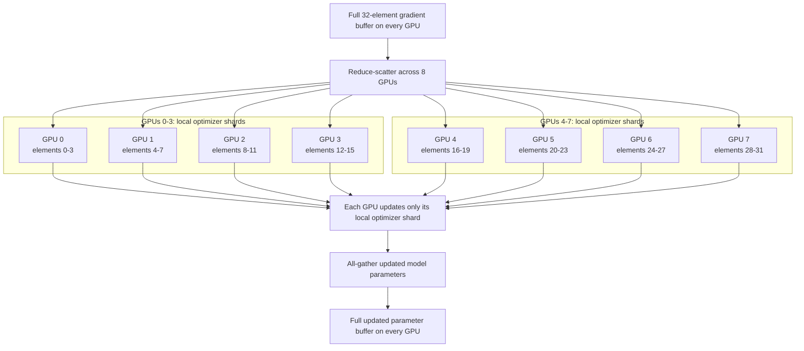
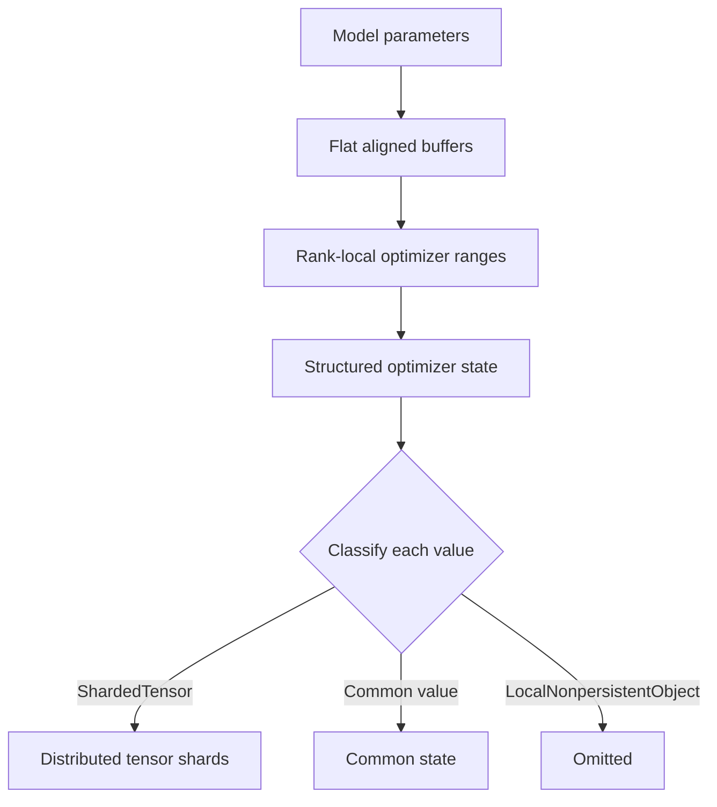
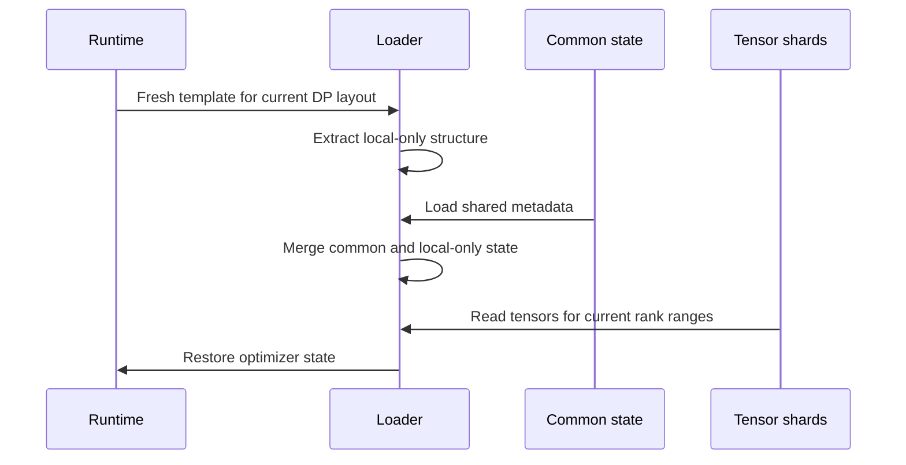

# How Distributed Optimizer Checkpoints Work in Megatron

> **TL;DR:** Megatron flattens model parameters into aligned buffers and partitions optimizer state across data-parallel ranks. Its distributed checkpoint format describes tensors by their global identity rather than by the rank that currently owns them, which allows a checkpoint saved with one data-parallel size to load with another. Runtime-only details such as padding are rebuilt locally instead of being treated as authoritative checkpoint data.

## The mental model

Adam stores first- and second-moment estimates plus a step counter for every
parameter. For mixed-precision training, Megatron also maintains a main
parameter used by the optimizer step. A DP-reshardable bucket entry is roughly:

```python
bucket_entry = {
    "param": main_param,
    "exp_avg": first_moment,
    "exp_avg_sq": second_moment,
    "step": step_count,
}
```

With the default mixed-precision optimizer configuration:

| Value | Shape | Default dtype |
|---|---:|---|
| Model parameter | Full parameter shape | bf16 or fp16 |
| Main gradient | Full parameter shape | fp32 |
| `param` (main parameter) | Rank-local parameter slice | fp32 |
| `exp_avg` | Rank-local parameter slice | fp32 |
| `exp_avg_sq` | Rank-local parameter slice | fp32 |
| `step` | Scalar `()` | Usually fp32 |

The model parameter and main gradient are related runtime buffers, not fields
inside this bucket entry. PyTorch represents `step` as a zero-dimensional
tensor; it is conceptually an integer counter but is usually stored as fp32.
Megatron handles it separately through optimizer parameter-group state rather
than treating it as a parameter-sized shard.

With the precision-aware optimizer enabled, `main_params_dtype`,
`main_grads_dtype`, `exp_avg_dtype`, and `exp_avg_sq_dtype` can be configured
independently. Their defaults remain fp32.

### Estimating checkpoint size

Let `N` be the number of model parameters. With bf16 or fp16 model weights and
the default fp32 Adam state, the logical payload across all checkpoint files is
approximately:

| Saved data | Bytes per parameter |
|---|---:|
| Model weight | 2 |
| Main parameter | 4 |
| `exp_avg` | 4 |
| `exp_avg_sq` | 4 |
| **Total** | **14** |

Gradients are runtime data and are normally not checkpointed. The scalar
`step`, parameter-group metadata, and scheduler state are small compared with
the parameter-sized tensors.

For a model with `x` billion parameters:

```text
model-only checkpoint     ~=  2x GB
optimizer portion         ~= 12x GB
full training checkpoint  ~= 14x GB
```

| Model size | Approximate full checkpoint |
|---:|---:|
| 8B parameters | 112 GB (104 GiB) |
| 27B parameters | 378 GB (352 GiB) |
| 70B parameters | 980 GB (913 GiB) |

If `x GB` refers to the size of an existing bf16 weight checkpoint instead of
the parameter count, the full training checkpoint is approximately `7x GB`.

Data parallelism divides optimizer ownership across ranks, so each rank owns
roughly `1 / DP` of the optimizer payload. It does not reduce aggregate storage:
the sum across checkpoint files remains approximately the same. Alignment
gaps, serialization metadata, and filesystem allocation add overhead, while
precision-aware optimizer dtypes can reduce the estimate.

In ordinary data parallelism, every rank keeps a complete copy of this state.
For a large model, those copies consume substantial memory.

Megatron's distributed optimizer follows the same broad idea as ZeRO: every
data-parallel rank owns only part of the optimizer state.

Assume DP=8 with one rank per GPU and a 32-element flat buffer:



Each rank updates its local shard. Megatron then all-gathers the updated model
parameters so every data-parallel replica can run the next forward pass.

The checkpoint must preserve the global optimizer state without assuming that
the same rank will own the same range when the checkpoint is loaded.

## Runtime layout

### Flat parameter and gradient buffers

Running a collective for every small parameter would be inefficient. Megatron
packs parameters and gradients into a few large contiguous buffers:

```text
[parameter A][padding][parameter B][parameter C][bucket padding]
```

Parameters become views into these buffers. This layout enables large
reduce-scatter and all-gather operations, communication overlap, and direct
rank-local optimizer shards.

Megatron groups buffers by parameter dtype and gradient dtype:

```python
buffer_key = (parameter.dtype, gradient.dtype)
```

For example, `(torch.bfloat16, torch.float32)` means bf16 parameters with fp32
accumulated gradients. It does not mean bf16 and fp32 parameters share one
buffer.

The implementation is split across three steps:

1. `DistributedDataParallel` collects trainable parameters, groups them by
   buffer key, and creates one `_ParamAndGradBuffer` per group.
2. `DistributedOptimizer._compute_per_buffer_param_layout` walks parameters in
   reverse backpropagation order, applies alignment and bucket padding, and
   records `(start, end, bucket_id)` for every parameter.
3. `_ParamAndGradBuffer` allocates flat `param_data` and `grad_data` tensors.
   It replaces `param.data` with a view into `param_data` and assigns
   `param.main_grad` to a view into `grad_data`.

The key source locations are:

- [`DistributedDataParallel` buffer construction](https://github.com/NVIDIA/Megatron-LM/blob/740c16e6b80a753bea26232148d9bb2d7f0c827a/megatron/core/distributed/distributed_data_parallel.py#L115-L257)
- [`DistributedOptimizer` padded layout construction](https://github.com/NVIDIA/Megatron-LM/blob/740c16e6b80a753bea26232148d9bb2d7f0c827a/megatron/core/optimizer/distrib_optimizer.py#L485-L565)
- [`_ParamAndGradBuffer` allocation and parameter views](https://github.com/NVIDIA/Megatron-LM/blob/740c16e6b80a753bea26232148d9bb2d7f0c827a/megatron/core/distributed/param_and_grad_buffer.py#L950-L1277)

### Alignment and padding

Megatron aligns parameter starts and bucket boundaries for efficient memory
access and collective communication. A 48-element parameter followed by
64-element start alignment creates a 16-element gap:

```python
def align_up(value: int, divisor: int) -> int:
    return ((value + divisor - 1) // divisor) * divisor


parameter_end = 48
next_parameter_start = align_up(parameter_end, 64)

assert next_parameter_start == 64
assert next_parameter_start - parameter_end == 16
```

Padding belongs to the physical buffer layout, not to the mathematical model.
It can change with bucket construction, parameter order, dtype grouping, or
data-parallel size.

### Rank-local optimizer ranges

For every parameter that intersects a rank's local range, Megatron records
the local parameter slice and its optimizer tensors:

```text
parameter
master parameter
first moment (exp_avg)
second moment (exp_avg_sq)
local start offset
local end offset
```

Missing ranges between parameter slices become padding entries. The resulting
state is a nested structure organized roughly as:

```text
optimizer state
  -> model chunk
    -> gradient buffer
      -> (parameter dtype, gradient dtype)
        -> bucket
          -> parameter or padding entry
```

This nested structure is both optimizer state and a description of the local
runtime layout.

## What the checkpoint stores

Megatron's distributed checkpointing system classifies values into three
categories:

| Category | Example | Behavior |
|---|---|---|
| Sharded tensor | Local `exp_avg` slice | Saved with global shape and offset metadata |
| Common state | Optimizer configuration | Saved once as replicated data |
| Local non-persistent state | Padding marker | Omitted and rebuilt during load |

The important distinction is authority:

- Tensor contents such as Adam moments are authoritative checkpoint data.
- Shared metadata is authoritative but not sharded.
- Layout-derived values describe the current process and are not authoritative.

`LocalNonpersistentObject` marks values in the third category. The serializer
omits them during save, and the loader takes fresh values from the newly built
runtime template.

### Two optimizer checkpoint formats

Megatron supports two distributed optimizer checkpoint formats:

- `dp_reshardable` is the default and faster format. It supports changing the
  data-parallel layout, but not the model-parallel layout.
- `fully_reshardable` is slower but supports arbitrary model-parallel changes.
  It is enabled with `--dist-ckpt-optim-fully-reshardable`.

The rest of this tutorial focuses on `dp_reshardable`: the model-parallel
layout remains fixed while optimizer shards move between data-parallel ranks.

## How `dp_reshardable` represents state

`dp_reshardable` stores optimizer state in **bucket space**, matching the
distributed optimizer's internal flat buffers. It does not first gather state
or convert it back into one tensor per model parameter.

`get_parameter_state_dp_reshardable()` builds a no-copy view with this shape:

```text
parameter state
  -> gradient buffer index
    -> dtype
      -> bucket
        -> parameter slice
          -> param
          -> exp_avg
          -> exp_avg_sq
          -> step
          -> local start and end offsets
```

The representation is fully sharded already: each rank's tensors are the
optimizer slices that rank currently owns. This is why save and load need no
DP gather, scatter, or intermediate world-sized buffer.

For every bucket and optimizer field, Megatron describes one logical global
1-D checkpoint tensor:

```python
ShardedTensor(
    key=f"{bucket_key}.{state_name}",
    data=local_state_slice,
    global_shape=(bucket_numel_unpadded,),
    global_offset=(dp_rank * local_bucket_numel + local_start,),
)
```

Separate parameter and padding entries reuse the same key and cover different
offsets of that global tensor. The checkpoint strategy combines them by global
offset rather than by rank or Python-list position.

### Which padding is saved?

A bucket contains two different forms of padding:

```text
[param][internal gap][param][internal gap][DP tail padding]
```

- Internal alignment gaps are included. They are part of the stable bucket
  coordinate system and keep parameter offsets consistent.
- Final bucket padding is excluded. It exists only to make the runtime bucket
  divisible by the current DP size and may change after resharding.

Therefore the checkpoint tensor's global shape is
`bucket_numel_unpadded`, while each rank's runtime range is calculated from the
larger DP-padded bucket.

## `dp_reshardable` save flow

The following pseudocode captures the design:

```python
# Existing optimizer tensors; no gather or copy.
runtime_state = get_parameter_state_dp_reshardable()

# Insert tensor-shaped entries for uncovered internal gaps.
runtime_state = insert_internal_padding(runtime_state)

# Map every real or padding tensor slice into a global bucket tensor.
sharded_state = convert_slices_to_sharded_tensors(runtime_state)

# These describe runtime structure rather than checkpoint tensor contents.
mark_local_nonpersistent(sharded_state, keys={"padding", "step"})

# Remove runtime-only values, then separate tensor shards from common state.
local_only, persistent_state = extract_local_nonpersistent(sharded_state)
sharded_tensors, common_state = extract_sharded_tensors(persistent_state)

# Persist authoritative data.
save_distributed_tensors(sharded_tensors)
save_once(common_state)

# local_only is intentionally not saved.
```

The scalar `step` follows a separate path. `DistributedOptimizer.state_dict()`
removes parameter-sized tensor state, stores optimizer parameter-group
metadata, and saves one common step value through those parameter groups.
During load, Megatron recreates the per-parameter scalar tensors from that
value. Consequently, bucket entries mark `step` non-persistent.

Each `ShardedTensor` carries enough metadata to identify its position in a
global tensor, including its global shape and local offset. The storage
strategy can therefore write rank-local pieces without making rank identity
part of the logical checkpoint.



## `dp_reshardable` load and reshard flow

Loading starts by constructing the optimizer for the current runtime. This
creates a fresh state template using the current data-parallel size and buffer
layout.

The loader then:

1. Extracts local non-persistent values from the fresh template.
2. Loads common checkpoint state.
3. Merges the common state with the fresh local-only structure.
4. Loads tensor shards into the ranges requested by the current ranks.
5. Removes entries marked as padding.
6. Copies each loaded main parameter and Adam state slice into the current
   optimizer.

```python
# The current topology determines this template.
fresh_template = build_rank_local_optimizer_state()
local_only = extract_local_nonpersistent(fresh_template)

common_state = load_common_state()
load_template = merge(common_state, local_only)

# The strategy reads the pieces needed by this rank.
load_distributed_tensors_into(load_template)
optimizer.load_state_dict(load_template)
```



The fresh template answers "what does this rank need now?" The checkpoint
metadata answers "where is that data in the global tensor?" This separation is
what makes data-parallel resharding possible.

Before copying the loaded tensors, Megatron asserts that
`per_bucket_numel_unpadded` matches the current runtime. This captures the
format's central limitation:

| Property | May change? |
|---|---|
| DP world size and rank ownership | Yes |
| DP-dependent bucket tail padding | Yes; rebuilt locally |
| Tensor or pipeline model parallel layout | No |
| Parameter order, dtype grouping, and bucket boundaries | Must remain compatible |
| Unpadded elements per bucket | No; checked during load |

## Toy example: DP-dependent padding changes

Suppose the stable part of a bucket contains 1,000 elements. Saving with DP=3
requires padding the runtime bucket to 1,152 elements, while loading with DP=4
requires only 1,024. The checkpoint still describes one global tensor of
exactly 1,000 elements.

```python
def checkpoint_ranges(
    unpadded_numel: int,
    padded_numel: int,
    world_size: int,
) -> list[tuple[int, int]]:
    """Return the useful checkpoint range owned by each DP rank."""
    assert padded_numel % world_size == 0
    local_numel = padded_numel // world_size
    return [
        (rank * local_numel, min((rank + 1) * local_numel, unpadded_numel))
        for rank in range(world_size)
        if rank * local_numel < unpadded_numel
    ]


save_ranges = checkpoint_ranges(
    unpadded_numel=1_000,
    padded_numel=1_152,
    world_size=3,
)
assert save_ranges == [
    (0, 384),
    (384, 768),
    (768, 1_000),
]

load_ranges = checkpoint_ranges(
    unpadded_numel=1_000,
    padded_numel=1_024,
    world_size=4,
)
assert load_ranges == [
    (0, 256),
    (256, 512),
    (512, 768),
    (768, 1_000),
]
```

At save time, the last rank's 384-element runtime shard contains only 232
checkpoint elements; its remaining 152 elements are DP tail padding. At load
time, rank 3 reads elements `768..999` and locally rebuilds 24 tail-padding
elements. No rank needs to reconstruct all 1,000 values.

## Why non-persistent state matters

The saved common state and the fresh local-only state must have compatible
structures. Persisting only some values inside a layout-derived list can
accidentally change its shape.

Consider a runtime list:

```text
[parameter A, padding, parameter B]
```

If only the two parameter entries contain a persistent scalar, common-state
extraction can produce:

```text
[parameter A scalar, parameter B scalar]
```

The loader cannot infer where the missing padding entry belongs. Values that
follow the runtime layout must therefore be explicitly marked non-persistent
or represented by a fully authoritative schema.

A useful invariant is:

```text
Persist both structure and value authoritatively,
or reconstruct both structure and value locally.
Do not persist a sparse fragment of reconstructed structure.
```

## Common pitfalls

### Rank identity is not tensor identity

A local rank and offset only describe current ownership. Checkpoint metadata
must identify the global tensor and global offset so a different topology can
request a different slice.

### Skipping sharded conversion does not make data non-persistent

If a value is neither converted to `ShardedTensor` nor wrapped as
`LocalNonpersistentObject`, it can remain ordinary common state. Serialization
behavior should always be explicit.

### Padding is structural

Padding affects list positions and local ranges even though it has no optimizer
value. Save and load code must agree on whether that structure is persisted or
reconstructed.

### Optimizer checkpoints are versioned protocols

The nested Python state is effectively a protocol shared by the optimizer,
checkpoint strategy, model layout, and framework version. A small type or
nesting change can alter how values are classified.

### Saving is not enough to prove resharding works

Tests should save and load across different data-parallel sizes and compare
the complete optimizer state. Useful cases include:

- Same topology save and load.
- Smaller-to-larger data-parallel size.
- Larger-to-smaller data-parallel size.
- Parameters that create alignment gaps.
- Multiple parameter and gradient dtype groups.

## Further reading

Start with NVIDIA's distributed optimizer guide for the memory and
communication model. Then read the distributed checkpointing API guide for
the sharded-state abstraction and resharding behavior. The ZeRO paper explains
the broader motivation for partitioning optimizer state.

For source-level study, follow this order:

1. Parameter and gradient buffer construction.
2. Distributed optimizer range mapping.
3. DP-reshardable optimizer state generation.
4. Non-persistent state preprocessing.
5. Recursive state merge.

## References

- [NVIDIA Megatron Core: Distributed Optimizer](https://docs.nvidia.com/megatron-core/developer-guide/latest/user-guide/features/dist_optimizer.html)
- [NVIDIA Megatron Core: Distributed Checkpointing](https://docs.nvidia.com/megatron-core/developer-guide/latest/api-guide/core/dist_checkpointing.html)
- [PyTorch: Distributed Checkpoint](https://docs.pytorch.org/docs/stable/distributed.checkpoint.html)
- [PyTorch: AdamW](https://docs.pytorch.org/docs/stable/generated/torch.optim.AdamW.html)
- [ZeRO: Memory Optimizations Toward Training Trillion Parameter Models](https://arxiv.org/abs/1910.02054)
- [Megatron-LM: Parameter-buffer alignment and grouping](https://github.com/NVIDIA/Megatron-LM/blob/740c16e6b80a753bea26232148d9bb2d7f0c827a/megatron/core/optimizer/param_layout.py#L19-L66)
- [Megatron-LM: DDP buffer construction](https://github.com/NVIDIA/Megatron-LM/blob/740c16e6b80a753bea26232148d9bb2d7f0c827a/megatron/core/distributed/distributed_data_parallel.py#L115-L257)
- [Megatron-LM: Flat buffer allocation and parameter views](https://github.com/NVIDIA/Megatron-LM/blob/740c16e6b80a753bea26232148d9bb2d7f0c827a/megatron/core/distributed/param_and_grad_buffer.py#L950-L1277)
- [Megatron-LM: Optimizer state dtype configuration](https://github.com/NVIDIA/Megatron-LM/blob/740c16e6b80a753bea26232148d9bb2d7f0c827a/megatron/core/optimizer/optimizer_config.py#L187-L206)
- [Megatron-LM: Common optimizer state and step handling](https://github.com/NVIDIA/Megatron-LM/blob/740c16e6b80a753bea26232148d9bb2d7f0c827a/megatron/core/optimizer/distrib_optimizer.py#L781-L841)
- [Megatron-LM: DP-reshardable optimizer state](https://github.com/NVIDIA/Megatron-LM/blob/740c16e6b80a753bea26232148d9bb2d7f0c827a/megatron/core/optimizer/distrib_optimizer.py#L1173-L1209)
- [Megatron-LM: Optimizer checkpoint format dispatcher](https://github.com/NVIDIA/Megatron-LM/blob/740c16e6b80a753bea26232148d9bb2d7f0c827a/megatron/core/optimizer/distrib_optimizer.py#L1406-L1526)
- [Megatron-LM: DP-reshardable padding and shard conversion](https://github.com/NVIDIA/Megatron-LM/blob/740c16e6b80a753bea26232148d9bb2d7f0c827a/megatron/core/optimizer/distrib_optimizer.py#L1774-L1922)
- [Megatron-LM: DP-reshardable inverse load](https://github.com/NVIDIA/Megatron-LM/blob/740c16e6b80a753bea26232148d9bb2d7f0c827a/megatron/core/optimizer/distrib_optimizer.py#L2007-L2039)
- [Megatron-LM: Non-persistent state preprocessing](https://github.com/NVIDIA/Megatron-LM/blob/740c16e6b80a753bea26232148d9bb2d7f0c827a/megatron/core/dist_checkpointing/state_dict_utils.py#L25-L98)
- [Megatron-LM: Recursive checkpoint merge](https://github.com/NVIDIA/Megatron-LM/blob/740c16e6b80a753bea26232148d9bb2d7f0c827a/megatron/core/dist_checkpointing/dict_utils.py#L220-L240)
