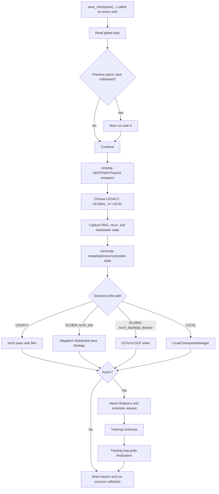
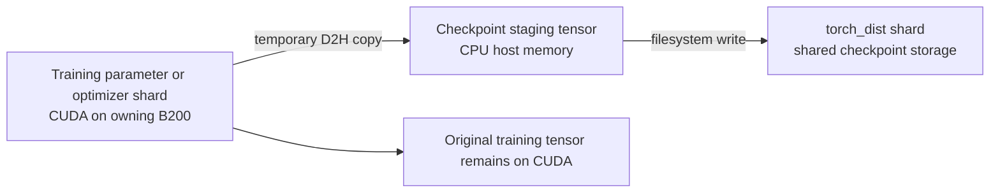

# How Megatron-LM `save_checkpoint` Works

> **TL;DR:** Megatron-LM's `save_checkpoint` is an orchestration layer, not a
> single `torch.save` call. It chooses a checkpoint type and storage backend,
> builds model/optimizer/scheduler/RNG state, coordinates all distributed
> ranks, schedules or performs the write, and only then publishes the new
> iteration through `latest_checkpointed_iteration.txt`. With asynchronous
> saving, publishing and success callbacks are deferred until the background
> write has actually completed.

This tutorial describes the implementation at Megatron-LM commit
[`1c742862`](https://github.com/NVIDIA/Megatron-LM/blob/1c742862114775b3830523c6cd55f3b6e72b68dd/megatron/training/checkpointing.py#L510-L954).
Checkpoint internals change frequently, so line-level details should be
rechecked when upgrading Megatron-LM.

## Why this matters / The question that started it

The function is imported with:

```python
from megatron.training.checkpointing import save_checkpoint
```

Its call looks deceptively simple:

```python
save_checkpoint(
    iteration,
    model,
    optimizer,
    opt_param_scheduler,
    num_floating_point_operations_so_far=0,
)
```

That can create the impression that it serializes a Python dictionary and
returns. In distributed training, however, a valid checkpoint has stronger
requirements:

1. Every tensor shard must be represented exactly once.
2. Common metadata must agree across ranks.
3. Optimizer and scheduler state must correspond to the same model iteration.
4. RNG and rerun state must be captured for reproducibility.
5. A partially written checkpoint must not be advertised as the latest valid
   checkpoint.
6. Asynchronous writes must eventually be finalized and errors surfaced.

`save_checkpoint` coordinates all of these responsibilities.

## Core concepts

### A training checkpoint is more than model weights

Megatron constructs a state dictionary containing some or all of:

```text
args
checkpoint_version
iteration
model or model0, model1, ...
optimizer
opt_param_scheduler
rerun_state_machine
rng_state
num_floating_point_operations_so_far
```

The exact content depends on options such as `--no-save-optim` and
`--no-save-rng`. Model lists are common because virtual pipeline parallelism
can create multiple model chunks in one process.

Saving only model weights can support inference or fine-tuning, but it cannot
faithfully resume training. A full resume also needs optimizer moments,
learning-rate schedule position, random-number-generator state, and iteration
metadata.

### Logical state and physical files are different layers

The state dictionary describes the logical checkpoint. The selected backend
decides how that state becomes files:

| Type or format | Intended storage | Write mechanism |
|---|---|---|
| `LEGACY` | Shared storage, rank-specific files | `torch.save` |
| `GLOBAL` + `torch_dist` | Shared storage, distributed shards | Megatron Core distributed checkpointing |
| `GLOBAL` + `torch_dcp` | Shared storage, distributed shards | PyTorch Distributed Checkpoint |
| `GLOBAL` + `fsdp_dtensor` | Shared storage, distributed DTensor state | PyTorch Distributed Checkpoint |
| `LOCAL` | Node-local SSD or RAM disk | `LocalCheckpointManager` |

`GLOBAL` does not mean one file or one copy per rank. It means all ranks
collectively produce one logically complete checkpoint in globally accessible
storage. The result can contain many shard files.

`LOCAL` means each rank saves its portion to local storage. It is optimized for
fast, non-persistent recovery and may use replication, but is not the normal
portable checkpoint path.

`LEGACY` is the older rank-file layout. It is selected when distributed
checkpointing is disabled.

### Persistent and global are not synonyms

The normal save path is persistent. Megatron also supports periodic
non-persistent saves:

- A non-persistent **global** checkpoint uses the standard distributed format
  on shared storage but removes older checkpoints.
- A non-persistent **local** checkpoint writes rank-local pieces through the
  local checkpoint manager.

Therefore, checkpoint type answers "how and where is this represented?" while
retention answers "how long should it be kept?"

### The tracker file is the commit marker

Megatron stores:

```text
<save-dir>/latest_checkpointed_iteration.txt
```

The file contains an iteration number such as `1200`, or `release` for a
release checkpoint. Loading reads this file to decide which checkpoint is
authoritative.

The critical invariant is:

```text
Do not update the tracker until all checkpoint data is durable.
```

For synchronous saves, the tracker is updated after the write. For
asynchronous saves, tracker update is registered as a finalization callback.
This keeps a partially written `iter_*` directory from becoming the selected
resume point.

### Sharded state describes global tensor identity

For `torch_dist`, model and optimizer objects produce a
`sharded_state_dict()`. Tensor entries include global shape and offset metadata,
allowing each rank to contribute its local data while the checkpoint represents
the global tensor.

Megatron Core's serializer separates:

- sharded tensors and objects,
- common replicated state,
- local non-persistent objects.

Rank 0 writes common state, while the selected save strategy writes tensor
shards. This is the foundation for resharding a checkpoint when the parallel
configuration changes.

For a deeper treatment of optimizer shards, see
[How Distributed Optimizer Checkpoints Work in Megatron](megatron-distributed-optimizer-checkpoints.md).

## How it works

### End-to-end control flow



### Phase 1: detect checkpoint backlog

The first operational check is:

```python
if args.async_save and not is_empty_async_queue():
    print_rank_0(
        "WARNING: Starting a checkpoint save before previous has finished. "
        "Consider increasing the checkpoint interval."
    )
```

`is_empty_async_queue()` is true when there are no unfinalized async calls.
The negation therefore means at least one previous request is still writing or
awaiting finalization.

This is only a warning. The function does not wait, cancel the old request, or
skip the new checkpoint. Repeated warnings mean checkpoint production is
faster than the storage path can consume it. Consequences can include queued
work, greater host-memory pressure, and sustained filesystem contention.

There is a documentation bug in the helper at this commit: its docstring says
`True` means an ongoing call, while its implementation clearly returns `True`
for an empty queue.

### Phase 2: start metrics and fault-tolerance monitoring

Megatron records checkpoint productivity metrics and notifies its
fault-tolerance integration:

```python
productive_metrics = on_save_checkpoint_start(args.async_save)
ft_integration.on_checkpointing_start()
```

These calls do not serialize model state. They bracket the operation for
observability and checkpoint timeout handling.

### Phase 3: unwrap model wrappers

```python
model = unwrap_model(model)
```

Training models may be nested inside wrappers:

```text
DistributedDataParallel(Float16Module(GPTModel))
```

`unwrap_model` repeatedly follows `.module` for recognized wrappers:

- Megatron distributed data parallel,
- Torch FSDP,
- Megatron FSDP,
- `Float16Module`.

The result is the underlying `GPTModel`. If the input is a list, its list
structure is preserved. No parameters are copied and the original wrappers are
not modified; only the local `model` variable is rebound.

Checkpoint code needs the underlying module's
`sharded_state_dict()` or `state_dict_for_save_checkpoint()` implementation,
not the wrapper's runtime bookkeeping.

The nearby comment, "Only rank zero of the data parallel writes to the disk,"
is an oversimplification for modern distributed formats. Unwrapping does not
choose writers. Later rank filtering and the selected storage strategy decide
which ranks write common state and tensor shards.

### Phase 4: select checkpoint type and directory

The default is:

```python
ckpt_type = (
    CheckpointType.GLOBAL
    if args.use_dist_ckpt
    else CheckpointType.LEGACY
)
save_dir = args.save
```

At this commit, `args.use_dist_ckpt` is derived from
`args.ckpt_format != "torch"`. The old `--use-dist-ckpt` CLI option is
deprecated and has no effect; `--ckpt-format` is authoritative.

Passing `non_persistent_ckpt=True` overrides this:

```python
if args.non_persistent_ckpt_type == "global":
    ckpt_type = CheckpointType.GLOBAL
    save_dir = (
        args.non_persistent_global_ckpt_dir
        or os.path.join(args.save, "non_persistent")
    )
elif args.non_persistent_ckpt_type == "local":
    ckpt_type = CheckpointType.LOCAL
    save_dir = checkpointing_context[
        "local_checkpoint_manager"
    ].local_ckpt_dir
```

Non-persistent global saves remove older iteration directories, keeping one by
default. Local saves require a previously initialized
`local_checkpoint_manager` in `checkpointing_context`.

Only global checkpoints retain `args.ckpt_format`. Legacy and local paths use
the `torch` format label:

```python
ckpt_format = (
    args.ckpt_format
    if ckpt_type == CheckpointType.GLOBAL
    else "torch"
)
```

### Phase 5: capture execution state

#### RNG state

Megatron gathers RNG state with knowledge of tensor, pipeline, data, and
context-parallel groups. This is necessary because distributed ranks can have
different RNG streams.

Restoring RNG state matters for:

- dropout masks,
- randomized data operations,
- stochastic model components,
- deterministic continuation after restart.

`--no-save-rng` excludes it from the final state dictionary.

#### Rerun state

The rerun state machine records information used by Megatron's rerun and fault
handling machinery:

```python
rerun_state = get_rerun_state_machine().state_dict(
    data_iterator=train_data_iterator,
    ckpt_format=args.ckpt_format,
)
```

#### Dataloader state

`maybe_save_dataloader_state` saves state only for dataloaders implementing the
expected `save_state` interface, currently aimed at Megatron Energon. Built-in
text dataloaders use their precomputed index files instead.

This dataloader state is saved through a separate path rather than simply being
inserted into the main model state dictionary.

### Phase 6: calculate the checkpoint path

Distributed checkpoints use an iteration directory:

```text
checkpoints/
├── latest_checkpointed_iteration.txt
└── iter_0001200/
    ├── common.pt
    ├── metadata.json
    └── ... tensor shard files ...
```

The directory is produced with:

```python
get_checkpoint_name(
    save_dir,
    iteration,
    return_base_dir=True,
)
```

Legacy checkpoints include model-parallel coordinates:

```text
checkpoints/
├── latest_checkpointed_iteration.txt
└── iter_0001200/
    ├── mp_rank_00/
    │   └── model_optim_rng.pt
    └── mp_rank_01/
        └── model_optim_rng.pt
```

Pipeline and expert parallel ranks add more rank components to those directory
names.

### Phase 7: build the logical state dictionary

For non-legacy checkpoints, Megatron first builds metadata describing the
optimizer sharding mode. It then calls `generate_state_dict`.

The model branch is format-dependent:

```python
if args.ckpt_format == "torch_dist":
    model_sd = model_chunk.sharded_state_dict(
        metadata=sharded_sd_metadata,
    )
else:
    model_sd = model_chunk.state_dict_for_save_checkpoint()
```

The optimizer follows the same distinction:

```python
if args.ckpt_format == "torch_dist":
    optimizer_sd = optimizer.sharded_state_dict(
        state_dict,
        metadata=sharded_sd_metadata,
    )
elif args.ckpt_format == "fsdp_dtensor":
    optimizer_sd = optimizer.sharded_state_dict(
        state_dict,
        metadata=sharded_sd_metadata,
    )
else:
    optimizer_sd = optimizer.state_dict()
```

The full shape is approximately:

```python
state_dict = {
    "args": args,
    "checkpoint_version": 3.0,
    "iteration": iteration,
    "model": model_state,  # or model0, model1, ...
    "optimizer": optimizer_state,
    "opt_param_scheduler": scheduler.state_dict(),
    "rerun_state_machine": rerun_state,
    "rng_state": rng_state,
    "num_floating_point_operations_so_far": flops,
}
```

Entries are omitted when their object is absent or a corresponding
`--no-save-*` option is enabled.

For legacy checkpoints, Megatron avoids writing duplicate data-parallel
replicas. The rank condition is more nuanced than `dp_rank == 0`: it uses the
union of data-parallel-rank-zero and expert-data-parallel-rank-zero writers so
that every unique tensor/expert shard is represented when dense and expert
parallel layouts differ.

### Phase 8: choose and execute the physical writer

#### `GLOBAL` with `torch_dist`

Megatron creates or reuses a `TorchDistSaveShardedStrategy`.
`checkpointing_context` can cache the strategy across saves:

```python
checkpointing_context["save_strategy"] = save_strategy
```

With `--ckpt-assume-constant-structure`, later saves can reuse checkpoint
structure metadata instead of repeating expensive validation and planning.
This optimization assumes the sharded state structure really is unchanged.

`--ckpt-fully-parallel-save` wraps the base strategy in
`FullyParallelSaveStrategyWrapper`, distributing save responsibility across a
selected process group.

The actual call is:

```python
async_save_request = dist_checkpointing.save(
    state_dict,
    checkpoint_name,
    save_strategy,
    async_sharded_save=args.async_save,
    validate_access_integrity=validate_sharding_integrity,
    content_metadata=sharded_sd_metadata,
    async_strategy=args.async_strategy,
    verify_integrity=args.verify_integrity,
)
```

Megatron Core's serializer:

1. applies sharded tensor factories,
2. removes local non-persistent objects,
3. separates sharded objects from common state,
4. writes common state,
5. writes tensor/object shards through the strategy,
6. writes checkpoint metadata only after successful completion.

If integrity verification is enabled, it also creates hashes after writing,
which requires an additional read pass over checkpoint files.

#### `GLOBAL` with `torch_dcp` or `fsdp_dtensor`

These formats use PyTorch Distributed Checkpoint. `fsdp_dtensor` first
normalizes special state such as FP8 and SwiGLU tensors.

The synchronous path creates a `FileSystemWriter` and calls:

```python
torch.distributed.checkpoint.save(
    state_dict=state_dict,
    storage_writer=fs_storage_writer,
)
```

The async path creates a filesystem async writer, performs save planning, and
turns the result into an async request. In this implementation, async support
for these formats depends on NVIDIA Resiliency Extension functionality.

#### `LOCAL`

Local checkpointing converts the state to an
`MCoreTensorAwareStateDict`:

```python
state_dict_for_save, cacheable_metadata = (
    MCoreTensorAwareStateDict.from_state_dict(
        state_dict,
        algo=args.non_persistent_local_ckpt_algo,
        cached_metadata=cached_metadata,
        parallelization_group=dp_cp_group,
    )
)

async_save_request = local_checkpoint_manager.save(
    state_dict_for_save,
    iteration,
    is_async=args.async_save,
)
```

The local structure metadata may also be cached across saves. Fully
reshardable distributed optimizer modes are rejected on this path, and local
checkpointing requires `nvidia-resiliency-ext`.

#### `LEGACY`

The legacy branch is the most direct:

```python
ensure_directory_exists(checkpoint_name)
torch.save(state_dict, checkpoint_name)
```

Async saving is explicitly unsupported for legacy checkpoints.

### Phase 9: synchronize synchronous saves

For non-local synchronous saves, all distributed ranks enter a barrier after
writing. This prevents one rank from moving ahead while another is still
producing checkpoint data.

There is another final barrier before the function returns in synchronous
mode. The exact barriers are part of the collective contract: all ranks must
enter `save_checkpoint` consistently.

### Phase 10: publish success

Rank 0 creates `iter_finalize_fn`. For global and legacy checkpoints, it:

1. writes the current iteration or `release` to the tracker,
2. prints the success message,
3. writes progress-log state if enabled,
4. optionally starts deletion of an older checkpoint.

The last rank also creates finalizers for productivity metrics and Weights &
Biases artifact handling.

Synchronous mode invokes these functions immediately after writing:

```python
iter_finalize_fn()
wandb_finalize_fn()
```

Async mode attaches them to the request:

```python
async_save_request.add_finalize_fn(iter_finalize_fn)
async_save_request.add_finalize_fn(wandb_finalize_fn)
```

That ordering is what makes the success log and tracker meaningful: they
describe a completed checkpoint, not merely a scheduled one.

### Phase 11: schedule and later finalize asynchronous saves

```mermaid
sequenceDiagram
    participant Train as Training rank
    participant Save as save_checkpoint
    participant Queue as AsyncCallsQueue
    participant Worker as Background worker
    participant Disk as Storage

    Train->>Save: save_checkpoint(iteration=N)
    Save->>Save: Build/stage checkpoint state
    Save->>Queue: schedule_async_save(request)
    Save-->>Train: Return; training continues
    Queue->>Worker: Execute write request
    Worker->>Disk: Write common state and shards
    Disk-->>Worker: Write completed
    Train->>Queue: maybe_finalize_async_save(blocking=False)
    Queue->>Train: Run tracker/logging finalizers
```

Scheduling occurs near the end of `save_checkpoint`:

```python
schedule_async_save(async_save_request)
```

The training loop polls once per iteration:

```python
maybe_finalize_async_save(blocking=False)
```

This finalizes requests that have already completed without waiting for active
ones. At shutdown, Megatron calls:

```python
maybe_finalize_async_save(blocking=True, terminate=True)
```

That call waits for remaining writes, runs finalizers, and closes the async
queue. Without this lifecycle, an async request could remain unfinalized and
its tracker update or errors might never be observed.

If knowledge-distillation logits are pending, their flush is scheduled after
the checkpoint request. Success finalizers are moved to the logits request so
the checkpoint is not reported successful until both outputs complete.

### Worked example: GLM-Air on 512 B200 GPUs

Consider this topology:

```text
Training:       64 nodes x 8 B200 = 512 GPUs
TP:             4
PP:             2
EP:             8
Dense DP:       64
```

The walkthrough uses these additional assumptions:

```text
Context parallelism (CP):       1
Expert tensor parallelism:      4 (defaults to TP)
Virtual pipeline parallelism:   disabled
Checkpoint format:              torch_dist
Async save:                     disabled
Distributed optimizer:          enabled
Optimizer checkpoint format:    dp_reshardable
Optimizer CPU offload:          disabled
Checkpoint iteration:           1000
```

These assumptions matter. CPU-offloaded optimizer state would start on host
memory, virtual pipeline parallelism could give each process multiple model
chunks, and a different rank order would change the global-rank formulas.

#### Derive the dense and expert parallel dimensions

Dense layers use TP, PP, and DP:

```text
dense model-parallel size = TP x PP
                          = 4 x 2
                          = 8 GPUs

dense DP = world size / dense model-parallel size
         = 512 / 8
         = 64
```

Expert layers additionally use expert parallelism. With expert tensor
parallelism defaulting to TP:

```text
expert model-parallel size = ETP x EP x PP
                           = 4 x 8 x 2
                           = 64 GPUs

expert DP = world size / expert model-parallel size
          = 512 / 64
          = 8
```

`dense DP=64` and `EP=8` are not independent multiplicative dimensions.
Instead, EP subdivides the dense DP coordinate:

```text
dense_dp = ep + EP * expert_dp
         = ep + 8 * expert_dp
```

Consequently:

| State | Unique model shards | Replication factor |
|---|---:|---:|
| Dense weights | `TP x PP = 8` | 64 dense-DP replicas |
| Expert weights | `ETP x EP x PP = 64` | 8 expert-DP replicas |

#### Map global ranks to parallel coordinates

Megatron's default rank order is `tp-cp-ep-dp-pp`. The first coordinate is
the fastest-changing coordinate. With CP=1, the dense rank generator has:

```text
global_rank = tp + TP * dense_dp + TP * dense_dp_size * pp
            = tp + 4 * dense_dp + 256 * pp
```

The expert rank generator has:

```text
global_rank = etp + ETP * ep + ETP * EP * expert_dp
              + ETP * EP * expert_dp_size * pp
            = etp + 4 * ep + 32 * expert_dp + 256 * pp
```

Equating the two formulas gives:

```text
tp = etp
dense_dp = ep + 8 * expert_dp
ep = dense_dp % 8
expert_dp = dense_dp // 8
```

Assume the launcher assigns eight consecutive global ranks to each node:

```text
node_index = global_rank // 8
physical_gpu_on_node = global_rank % 8
```

The process usually selects `cuda:<local_rank>`. If the launcher gives each
process a remapped `CUDA_VISIBLE_DEVICES`, the same physical GPU may appear
inside the process as `cuda:0`.

Representative ranks are:

| Global rank | Physical placement | PP | TP/ETP | Dense DP | EP | Expert DP | Local weight identity |
|---:|---|---:|---:|---:|---:|---:|---|
| 0 | node 0, GPU 0 | 0 | 0 | 0 | 0 | 0 | Stage 0, TP shard 0, expert partition 0 |
| 1 | node 0, GPU 1 | 0 | 1 | 0 | 0 | 0 | Stage 0, TP shard 1, expert partition 0 |
| 4 | node 0, GPU 4 | 0 | 0 | 1 | 1 | 0 | Same dense shard as rank 0; different experts |
| 32 | node 4, GPU 0 | 0 | 0 | 8 | 0 | 1 | Dense and expert weight replica of rank 0 |
| 255 | node 31, GPU 7 | 0 | 3 | 63 | 7 | 7 | Last rank of pipeline stage 0 |
| 256 | node 32, GPU 0 | 1 | 0 | 0 | 0 | 0 | Stage 1, TP shard 0, expert partition 0 |
| 511 | node 63, GPU 7 | 1 | 3 | 63 | 7 | 7 | Last rank of pipeline stage 1 |

For global rank 0, useful process groups are:

```text
TP group:        [0, 1, 2, 3]
PP group:        [0, 256]
Dense DP group:  [0, 4, 8, ..., 252]       # 64 ranks
EP group:        [0, 4, 8, ..., 28]        # 8 expert partitions
Expert DP group: [0, 32, 64, ..., 224]     # 8 expert replicas
```

The physical placement follows from the default rank order. Changing
Megatron's rank order or the launcher's global-rank assignment changes the
node/GPU table without changing the logical checkpoint algorithm.

#### Enter `save_checkpoint` on all ranks

All 512 processes call:

```python
save_checkpoint(
    iteration=1000,
    model=model,
    optimizer=optimizer,
    opt_param_scheduler=scheduler,
    num_floating_point_operations_so_far=flops,
    checkpointing_context=checkpointing_context,
)
```

This is collective code. Calling it only on global rank 0 would omit shards
and can deadlock collective operations.

On global rank 0, before unwrapping, the local object is conceptually:

```text
[DistributedDataParallel(Float16Module(GLMStage0))]
```

After:

```python
model = unwrap_model(model)
```

it is:

```text
[GLMStage0]
```

The stage-0, TP-0, EP-0 parameters remain on node 0's GPU 0. No tensor is
copied, gathered, or moved to CPU. On global rank 256, the equivalent local
object is `GLMStage1` on node 32's GPU 0.

With virtual pipeline parallelism disabled, PP=2 does not mean each process
has two model objects. A process owns one of the two pipeline stages. PP peers
collectively cover the full model.

#### Select the global `torch_dist` path

At this Megatron revision:

```python
args.use_dist_ckpt = args.ckpt_format != "torch"
```

Therefore:

```python
ckpt_type = CheckpointType.GLOBAL
save_dir = "/checkpoints/glm-air"
checkpoint_name = "/checkpoints/glm-air/iter_0001000"
```

The condition controlling state generation is:

```python
if (
    not torch.distributed.is_initialized()
    or ckpt_type != CheckpointType.LEGACY
    or dp_rank == 0
    or expt_dp_rank == 0
):
    state_dict = generate_state_dict(...)
```

Because `ckpt_type != LEGACY` is true, all 512 ranks enter. The
`dp_rank == 0 or expt_dp_rank == 0` writer filtering applies only to legacy
rank-file checkpoints.

#### Build sharded model state without moving weights

Each rank invokes its local model stage:

```python
model_sd = model[i].sharded_state_dict(
    metadata=sharded_sd_metadata,
)
```

A conceptual rank-0 entry is:

```python
ShardedTensor(
    key="decoder.layers.0.mlp.linear_fc1.weight",
    data=local_cuda_tensor,
    dtype=local_cuda_tensor.dtype,
    local_shape=(...),
    global_shape=(...),
    global_offset=(...),
    replica_id=(...),
)
```

At this point:

```text
local_cuda_tensor.device = node 0's GPU 0
```

`ShardedTensor` is a mapping between existing local data and its position in a
logical global tensor. Creating it does not gather the global weight and does
not create a CPU copy.

The important replica relationships are:

```text
Rank 0 versus rank 4:
  same PP=0 and TP=0 dense shard
  different dense-DP replica
  different EP partition, so expert weights differ

Rank 0 versus rank 32:
  same PP=0 and TP/ETP=0
  same EP=0
  different expert-DP replica
  dense and expert model weights are replicas

Rank 0 versus rank 256:
  different PP stage
  model weights cover different layers
```

#### Build sharded optimizer state

Assuming the distributed optimizer is enabled without CPU offload:

| Runtime value | Device before save | Distribution |
|---|---|---|
| bf16/fp16 model weights | CUDA | Dense DP or expert DP replicated |
| FP32 main parameters | CUDA | Partitioned across the relevant DP group |
| Adam first moment | CUDA | Partitioned across the relevant DP group |
| Adam second moment | CUDA | Partitioned across the relevant DP group |
| Gradients | CUDA | Runtime state, normally not checkpointed |
| Scheduler and argument metadata | CPU/Python objects | Common state |

For each `(PP, TP)` dense model shard, the 64 dense-DP ranks partition its
distributed optimizer state:

```text
8 dense model shards x 64 DP optimizer partitions
= 512 rank-local dense optimizer partitions
```

For each `(PP, ETP, EP)` expert model shard, eight expert-DP ranks partition
its optimizer state:

```text
64 expert model shards x 8 expert-DP optimizer partitions
= 512 rank-local expert optimizer partitions
```

Unlike model weights, distributed optimizer partitions are not simply 64 or 8
identical replicas. Each rank owns checkpoint data needed to reconstruct the
global optimizer state.

#### Choose writers without moving GPU tensors between ranks

With fully parallel saving, Megatron wraps the base strategy:

```python
save_strategy = FullyParallelSaveStrategyWrapper(
    save_strategy,
    dense_dp_group,
    args.ckpt_assume_constant_structure,
)
```

The wrapper exchanges metadata and uses a greedy distribution algorithm to
choose which existing replica writes each model shard. It does not communicate
weight data between GPUs.

For example, ranks 0, 4, 8, and so on possess replicas of the same dense
PP-0/TP-0 shard. The strategy selects an available replica as the main writer.
For rank 0 and rank 32, either expert replica could be selected for their
shared PP-0/ETP-0/EP-0 expert weights.

The exact selected global rank cannot be inferred from topology alone. It
depends on shard sizes, the greedy distribution, process group, and whether a
previous distribution was cached.

Non-selected replicas keep their training weights on CUDA but do not stage
those replicas for checkpoint output. Unique optimizer partitions still need
to be represented.

#### Move selected data from CUDA to host memory

All ranks enter:

```python
dist_checkpointing.save(
    state_dict,
    checkpoint_name,
    save_strategy,
    async_sharded_save=False,
)
```

The synchronous `TorchDistSaveShardedStrategy.save` internally creates the
same save request machinery used by async saving and executes it
synchronously. Once planning determines which tensors a rank must write, the
filesystem writer stages each selected CUDA tensor:

```python
cpu_tensor = tensor.to("cpu", non_blocking=True)
torch.cuda.synchronize()
```

The placement transition for a selected rank is:



For a non-selected model replica:

```text
CUDA training weight -> remains on CUDA
CPU checkpoint copy   -> not created for that replica
filesystem write      -> not performed for that replica
```

The staging tensor is temporary. Saving does not replace the live CUDA model
parameter with a CPU tensor.

With optimizer CPU offload, some optimizer tensors would already reside on
host memory and would not follow this exact device-to-host path. With async
saving, staging and background-I/O timing also depends on the selected async
strategy and `cpu_shm_mode`.

#### Finalize and publish

After every rank completes its assigned writes:

1. The serializer finalizes distributed checkpoint metadata.
2. Synchronous barriers ensure ranks observe completion.
3. Global rank 0 writes:

```text
/checkpoints/glm-air/latest_checkpointed_iteration.txt
```

with:

```text
1000
```

Global rank 0 coordinates directory creation, common metadata, and tracker
publication. It never gathers the complete 106B model. The checkpoint is one
logical global state assembled from local CUDA shards, temporary host staging
copies, and distributed storage writes.

## Code examples

### Minimal call-site pattern

This is a call-site example, not a standalone program; process groups,
Megatron globals, model parallelism, and checkpoint configuration must already
be initialized.

```python
from megatron.training.checkpointing import save_checkpoint


def save_training_state(
    iteration,
    model,
    optimizer,
    scheduler,
    checkpointing_context,
):
    """Save one collectively coordinated training checkpoint."""
    save_checkpoint(
        iteration=iteration,
        model=model,
        optimizer=optimizer,
        opt_param_scheduler=scheduler,
        num_floating_point_operations_so_far=0,
        checkpointing_context=checkpointing_context,
        train_data_iterator=None,
        preprocess_common_state_dict_fn=None,
    )
```

Every participating rank must make the call with compatible arguments.

### Common format choices

```bash
# Megatron Core distributed checkpoint on shared storage.
torchrun ... pretrain_gpt.py --save /checkpoints/run --ckpt-format torch_dist

# Add asynchronous writing. This revision disables async saving unless the
# persistent checkpoint worker is enabled.
torchrun ... pretrain_gpt.py --save /checkpoints/run --ckpt-format torch_dist --async-save --use-persistent-ckpt-worker

# Legacy rank-file checkpoint.
torchrun ... pretrain_gpt.py --save /checkpoints/run --ckpt-format torch
```

Exact CLI spellings can change between Megatron-LM revisions. Check
`pretrain_gpt.py --help` for the version being run.

### Reading the tracker safely

```python
from pathlib import Path


def latest_iteration(checkpoint_root: Path) -> int:
    """Return the iteration Megatron has declared complete."""
    tracker = checkpoint_root / "latest_checkpointed_iteration.txt"
    value = tracker.read_text(encoding="utf-8").strip()
    if value == "release":
        raise ValueError("Release checkpoints do not have a numeric iteration")
    return int(value)
```

Do not infer completeness by selecting the lexicographically largest
`iter_*` directory. An async or failed save can leave a directory before it is
published by the tracker.

### Diagnosing async checkpoint backlog

If this warning repeats:

```text
WARNING: Starting a checkpoint save before previous has finished.
Consider increasing the checkpoint interval.
```

compare:

```text
checkpoint interval in seconds
    versus
checkpoint staging + write + finalization time
```

Practical responses include:

1. increasing the checkpoint interval,
2. measuring shared-filesystem throughput and contention,
3. reducing checkpoint payload only when resume requirements permit it,
4. using a supported parallel or async save strategy,
5. verifying that the training loop continues calling
   `maybe_finalize_async_save`.

## Common pitfalls / gotchas

### Treating `save_checkpoint` as a rank-0-only function

Distributed state generation and save strategies use collectives. Calling the
function only on rank 0 can deadlock or produce an incomplete checkpoint.
`print_rank_0` controls logging; it does not imply rank-0-only execution.

### Confusing `GLOBAL` with a single global file

A global checkpoint is logically complete and globally accessible, but its
tensors remain sharded across files. Rank 0 typically owns common metadata;
other ranks may write tensor shards.

### Confusing `GLOBAL` with persistent

Non-persistent global checkpoints exist. They use shared distributed storage
but aggressively delete older copies.

### Advertising an incomplete checkpoint

External tooling should follow `latest_checkpointed_iteration.txt`, not merely
scan for the newest iteration directory. The tracker update is intentionally a
post-write finalizer.

### Exiting before async finalization

Scheduling is not completion. A clean shutdown must call
`maybe_finalize_async_save(blocking=True, terminate=True)`.

### Saving too frequently

If each save takes longer than the interval between saves, requests accumulate.
The warning is a capacity signal, not harmless log noise.

### Assuming cached structure is always safe

`--ckpt-assume-constant-structure` improves performance by reusing planning
metadata. It is only valid if model and optimizer checkpoint structures remain
constant. Dynamic structural changes violate that assumption.

### Expecting topology changes to work for every optimizer format

Model distributed checkpoints can be reshardable, but optimizer formats have
additional constraints. The default DP-reshardable optimizer format does not
permit arbitrary model-parallel changes; fully reshardable optimizer state is
slower and has restrictions on local checkpointing.

### Saving model weights alone and expecting an exact resume

Without optimizer, scheduler, RNG, and iteration state, training does not
continue from the same mathematical state. A model-only artifact and a
training-resume checkpoint serve different purposes.

### Assuming every dataloader is checkpointed

The main function only saves dataloader state for loaders exposing Megatron's
expected interface. Dataset position may instead be reconstructed from index
files or other training metadata.

### Ignoring version compatibility

Checkpoint state is a protocol shared by model code, optimizer code,
serialization strategy, and Megatron version. Model weights often have broader
compatibility than optimizer state. Test save and resume across the exact
versions and topology changes planned for production.

## Further reading

Read the implementation in this order:

1. `save_checkpoint` for orchestration and backend selection.
2. `generate_state_dict` for logical checkpoint contents.
3. `dist_checkpointing.save` for common/sharded-state separation.
4. `async_utils` for request scheduling and finalization.
5. `load_checkpoint` to understand the inverse protocol.

The companion tutorial on
[distributed optimizer checkpoints](megatron-distributed-optimizer-checkpoints.md)
explains how optimizer shards are represented and resharded.

## References

- [Megatron-LM: `save_checkpoint` implementation](https://github.com/NVIDIA/Megatron-LM/blob/1c742862114775b3830523c6cd55f3b6e72b68dd/megatron/training/checkpointing.py#L510-L954)
- [Megatron-LM: checkpoint naming and tracker](https://github.com/NVIDIA/Megatron-LM/blob/1c742862114775b3830523c6cd55f3b6e72b68dd/megatron/training/checkpointing.py#L197-L316)
- [Megatron-LM: checkpoint state generation](https://github.com/NVIDIA/Megatron-LM/blob/1c742862114775b3830523c6cd55f3b6e72b68dd/megatron/training/checkpointing.py#L1064-L1139)
- [Megatron-LM: model unwrapping](https://github.com/NVIDIA/Megatron-LM/blob/1c742862114775b3830523c6cd55f3b6e72b68dd/megatron/core/utils.py#L2737-L2760)
- [Megatron Core: distributed save serialization](https://github.com/NVIDIA/Megatron-LM/blob/1c742862114775b3830523c6cd55f3b6e72b68dd/megatron/core/dist_checkpointing/serialization.py#L332-L396)
- [Megatron-LM: async checkpoint queue](https://github.com/NVIDIA/Megatron-LM/blob/1c742862114775b3830523c6cd55f3b6e72b68dd/megatron/training/async_utils.py#L109-L154)
- [Megatron-LM: async finalization in the training loop](https://github.com/NVIDIA/Megatron-LM/blob/1c742862114775b3830523c6cd55f3b6e72b68dd/megatron/training/training.py#L3635-L3654)
- [Megatron-LM: parallel rank generation](https://github.com/NVIDIA/Megatron-LM/blob/1c742862114775b3830523c6cd55f3b6e72b68dd/megatron/core/parallel_state.py#L446-L521)
- [Megatron-LM: dense and expert parallel dimensions](https://github.com/NVIDIA/Megatron-LM/blob/1c742862114775b3830523c6cd55f3b6e72b68dd/megatron/core/parallel_state.py#L730-L801)
- [Megatron Core: `ShardedTensor` device and global-tensor mapping](https://github.com/NVIDIA/Megatron-LM/blob/1c742862114775b3830523c6cd55f3b6e72b68dd/megatron/core/dist_checkpointing/mapping.py#L51-L91)
- [Megatron Core: fully parallel save distribution](https://github.com/NVIDIA/Megatron-LM/blob/1c742862114775b3830523c6cd55f3b6e72b68dd/megatron/core/dist_checkpointing/strategies/fully_parallel.py#L46-L139)
- [Megatron Core: CUDA-to-CPU checkpoint staging](https://github.com/NVIDIA/Megatron-LM/blob/1c742862114775b3830523c6cd55f3b6e72b68dd/megatron/core/dist_checkpointing/strategies/filesystem_async.py#L114-L249)
- [Megatron Core: Distributed Checkpointing](https://docs.nvidia.com/megatron-core/developer-guide/latest/api-guide/core/dist_checkpointing.html)
- [PyTorch: Distributed Checkpoint API](https://docs.pytorch.org/docs/stable/distributed.checkpoint.html)
- [PyTorch: Getting Started with Distributed Checkpoint](https://docs.pytorch.org/tutorials/recipes/distributed_checkpoint_recipe.html)
- [PyTorch: Asynchronous Saving with Distributed Checkpoint](https://docs.pytorch.org/tutorials/recipes/distributed_async_checkpoint_recipe.html)
